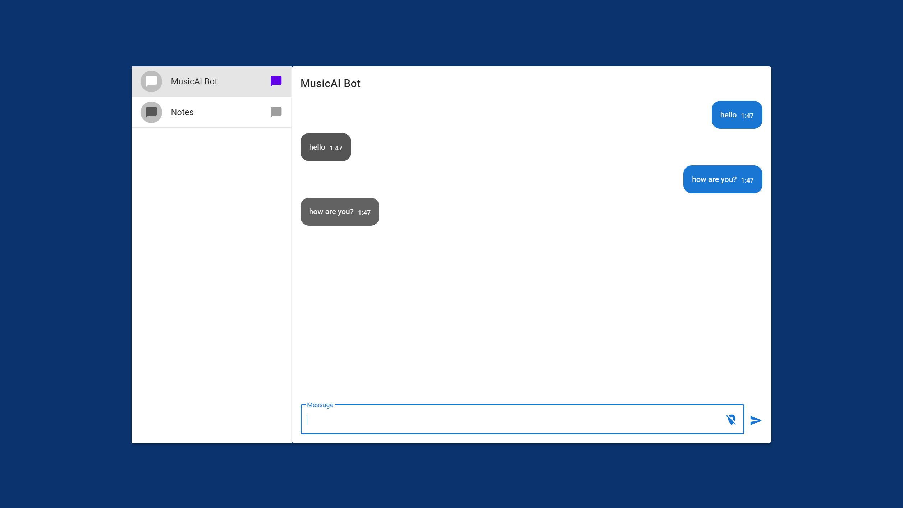

# Music-NLP Chatbot

  

 Chatbot to create music using natural language. Vue.js + Django



# Guidelines

In order to run this demo successfully, you need to do the following preparations.

1. Install Python3.

2. Install dependecies in `requirements.txt`.

3. Install Django 2.X.

```python
python -m pip install Django
```

4. Replace the environment to your root folder in python scripts.

```python
import sys
sys.path.insert(0,r"C:\Users\ldzha\OneDrive\AIM\music-nlp-chatbot")

```

5. Create database for logging. 

Enter `installation.py` and run.

```python
database_op.log_table_init('log.sqlite3')
database_op.creation_table_init('log.sqlite3')
```

5. Download GloVe word vectors.

Enter `installation.py` and run.

```python
vector = GloVe('6B',dim=50)
```

6. Run server.

```python
python manage.py runserver 10567
```

7. Visit website.

```
http://localhost:10567/
```


# References

1. https://zhuanlan.zhihu.com/p/54776124